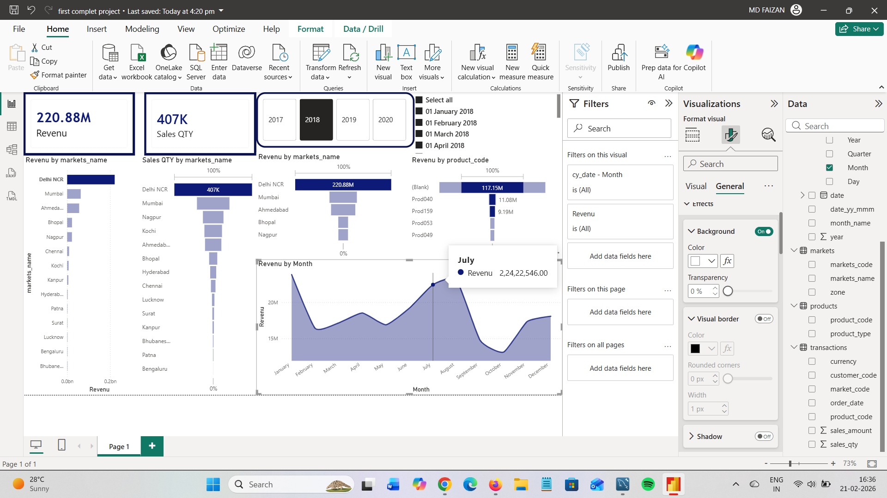

# Atliq Hardware Sales Analysis

## 📌 Project Overview
This project was created to analyze the sales performance of Atliq Hardware. 
The Sales Director, Bhavin Patel, was facing issues in understanding revenue trends, currency inconsistencies, and market performance. 

The objective of this project was to analyze transactional data using SQL and build a Power BI dashboard to provide clear business insights.

---

## 🎯 Business Problem
- Difficulty in tracking yearly sales performance
- Currency inconsistencies (INR and USD issues in data)
- Market-wise revenue analysis required
- Need for better visibility into transactions data

---

## 🛠 Tools Used
- SQL (Data Analysis & Cleaning)
- Power BI (Dashboard & Visualization)

---

## 📊 Key Analysis Performed Using SQL

- Total number of customers identified
- Market-wise transaction analysis (e.g., Mark001)
- Product distribution across specific markets
- Currency validation and inconsistency detection (INR, USD, INR\r, USD\r)
- Year 2020 revenue analysis
- Market-wise revenue calculation
- Total transaction count by currency
- Data cleaning checks for incorrect currency formatting

---

## 📈 Key Insights

- Identified currency inconsistencies affecting revenue calculation
- Calculated total sales for year 2020
- Found revenue contribution from specific market (Mark001)
- Detected multiple currency formats causing reporting issues

---

## 📂 Project Files
- `queries.sql` – SQL queries used for analysis
- `dashboard.pbix` – Power BI dashboard file
- `dashboard-preview.png` – Dashboard screenshot

---

## 📷 Dashboard Preview

---

## 🚀 Conclusion
This project helped identify data quality issues and provided structured insights into sales performance. 
The dashboard enables the Sales Director to monitor revenue trends, market performance, and transaction consistency more effectively.
